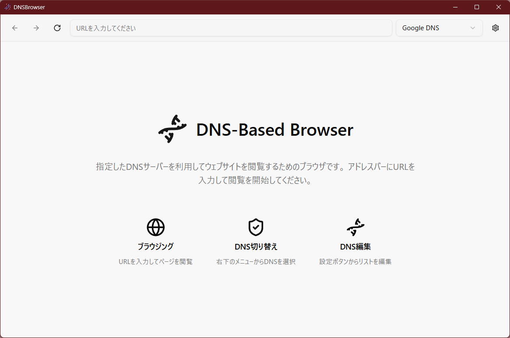

# DNS Based Browser

指定したDNSサーバーを利用してウェブサイトを閲覧するための、Electron製のシンプルなデスクトップブラウザです。



---

## ✨ 主な機能

### コア機能
- **カスタムDNSでの名前解決**: ユーザーが選択したDNSサーバーのIPアドレスを使い、ウェブサイトのドメイン名を解決します。
- **プロキシサーバー内蔵**: メインプロセスにHTTP/HTTPSプロキシを内蔵し、`<webview>`からのリクエストをすべてこのプロキシ経由にすることで、DNS解決を制御しています。
- **OSデフォルトDNSの利用**: カスタムDNSを指定しない「OS Default」の選択肢も用意されています。

### ブラウザ基本機能
- **ウェブページ表示**: `<webview>`タグを用いてウェブページを表示します。
- **ナビゲーション操作**: 「戻る」「進む」「再読み込み」の操作が可能です。
- **アドレスバー**:
    - URLを入力して任意のウェブページに遷移できます。
    - 入力されたURLが `http://` や `https://` で始まらない場合は、自動的に `https://` が補完されます。
    - アドレスバーが空の状態でEnterキーを押すと、`about:blank`ページに遷移します。
    - 現在のページが `about:blank` の場合、アドレスバーには何も表示されません。

### UI/UX
- **ウェルカムページ**: アプリケーションの初期状態（`about:blank`含む）では、機能紹介などを表示する専用のウェルカムページが表示されます。
- **エラー表示**: ページの読み込みに失敗した場合、エラーコードやURL、再読み込みボタンを含む専用のエラー画面を表示します。
- **テーマ**: ライトモードとダークモードに対応しています。

### DNS管理機能
- **DNSリストの永続化**: 追加したDNSサーバーのリスト（名前とホストIP）はPCのストレージに保存され、次回起動時にも維持されます。
- **DNS設定UI**:
    - コントロールパネルのドロップダウンメニューから、使用するDNSサーバーを即座に切り替えられます。
    - 設定ボタンからモーダルダイアログを開き、DNSサーバーのリストを自由に追加・編集・削除できます。

---

## 🛠️ 技術スタック

- [Electron](https://www.electronjs.org/)
- [React](https://reactjs.org/)
- [TypeScript](https://www.typescriptlang.org/)
- [Vite](https://vitejs.dev/)
- [Tailwind CSS](https://tailwindcss.com/)
- [Radix UI](https://www.radix-ui.com/) (for UI Primitives)

---

## 🚀 セットアップと実行

1.  **リポジトリをクローン**
    ```bash
    git clone [https://github.com/your-username/dns-based-browser.git](https://github.com/your-username/dns-based-browser.git)
    cd dns-based-browser
    ```

2.  **依存関係をインストール**
    ```bash
    npm install
    ```

3.  **開発モードで実行**
    ```bash
    npm run dev
    ```

4.  **アプリケーションをビルド**
    ```bash
    npm run build
    ```

---

## 📄 ライセンス

このプロジェクトは [MIT License](LICENSE) の下で公開されています。